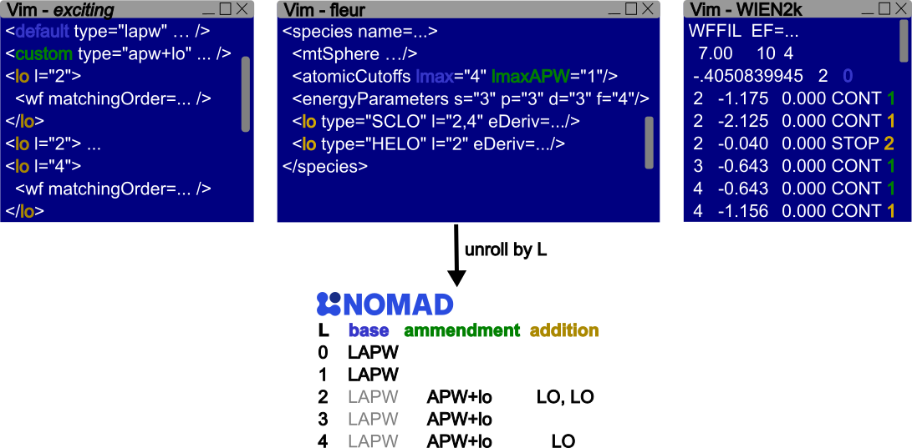

# Basis Sets

## Augmented Plane Wave

_Augmented Plane Waves_ (APW) is a highly customizable, full-potential basis set.
Since it describes both valence and core electrons (albeit in different ways), it is the preferred tool for comparing results between pseudopotential codeds [].
While the original formulation of APW leads to non-linear equations to solve, most modern-day implementations rely on a linear approximation that can be tuned to the desired precision.
To highlight this distinction, APW is also referred to as _Linearized Augmented Plane Waves_ (LAPW) [] or _Full-potential Augmented Plane Waves_ (FP-APW) [].
Unless stated otherwise, we use the terms interchangeably.

APW partitions the electronic wavefunctions and densities into 3 parts, each with its own distinct representation.
First _spatially_, along the muffin-tin boundaries (internal versus interstitial) surrounding each nucleus.
Inside the muffin-tin, the splits goes according to energy: those electrons that are represented as belonging to the core, and those to the valence bands.
The interstitial partition then serves to describe the dispersed nature of the valence electrons.
In this explainer, we focus on the **valence electrons inside the muffin-tin**.

Each code implementing APW, has to identify the valence electrons and then the basis set for the wavefunction (electron density).
Inside of the muffin-tin sphere, APW leverages the (near-)spherical symmetry of the potential to expand the basis set functions $u$ into the product of a $\text{`harmonic function`} * \text{`radial function`}$.

- **l-channel**: the main parameter determining the `harmonic function`.
- **energy parameter** $\epsilon$: the energy alignment of the wavefunction. In the historical APW, this value is optimized, and corresponds to the Hamiltonian eigenvalues upon convergence. [] In LAPW or FPAPW, however, it remains static, given as an initial parameter.
- **linear combinations**: linearization corrects the estimation error introduced by the initial $\epsilon$ by adding additional terms, including first (and by times higher-order) derivatives of the `radial function`. Each term can have its own, unrelated coefficients -which typically are still referred to as energy parameters.

### Code Formats

There are 4 known codes supporting APW: WIEN2k, Fleur, _exciting_, and ELk.
While each has to annotate the same 3 parameters, they go about it in quite a different way.

|---|---|---|
|code|orbital alignment|local orbitals|
|WIEN2k|EP|LO|
|Fleur|ND|SCLO, HELO, HDLO|
|exciting|EP, ND|full customizable|

- **orbital alignment**: the most straight-forward way is to simply have the user provide $\epsilon$ (Energy Parameter - EP). This initial starting point can also be optimized [], even between ionic updates []. A more sophisticated approach determines $\epsilon$ based on the target valence band, as determined by the main quantum number (n Determined - ND).
- **local orbitals**: there are several subtypes
  - lo: the radial function consists out of 2 terms, $u$ and its first derivative $\dot{u}$.
  - (HD)LO: is an extension of lo but with an additional term (3 in total). The derivative order of the last term is free to choose.
  - SCLO and HELO distinguish between LO based on its use, namely describing semicore states or vacant orbitals. The choice affects the derived $\epsilon$.

### Unrolling to NOMAD

Rather than writing out the each basis function, most codes condense the notation.
The typical format determines the radial part by l-channel and consists out of 3 segments:
1. **base**: this is the default setting for each l-channel, unless stated otherwise.
2. **ammendment**: these overwrite the default for a specific l-channel.
3. **addition**: encompass the local orbitals that extend specific l-channels.

In NOMAD we adopt a more verbose format to
- clarify the setup to those less experienced with APW.
- capture more nuanced differences between codes in a consistent fashion.

The process of _unrolling_ the compacted formats of the various codes is schematically shown below.

### Parsing Tools
