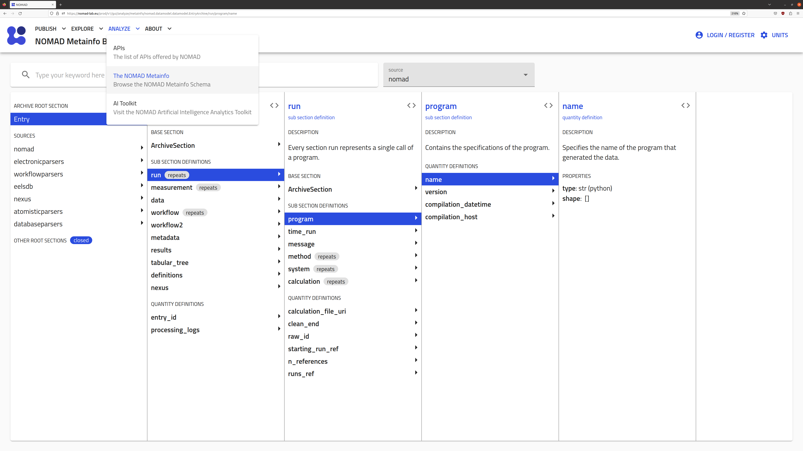

In the previous section, [How-to upload data](howto_upload_data.md), we showed that when the data was uploaded in the Uploads page, a processing of the raw data was triggered. 

    <label>
        <input type="checkbox">
        
    </label>

Once the data is added to the upload, NOMAD interprets the files and determines which of them is a **mainfile**. Any other files in the upload can be viewed as **auxiliary files**. In the same upload, there might be multiple mainfiles and auxiliary files organized in a folder tree structure.

The **mainfiles** are the main output file of a calculation. The presence of a mainfile in the upload is key for NOMAD to recognize a calculation. In NOMAD, we support several computational codes for first principles calculations, molecular dynamics simulations, and lattice modeling, as well as workflow and database managers. For each code, NOMAD recognizes a single file as the mainfile. For example, the [VASP](https://www.vasp.at/) mainfile is by default the `vasprun.xml`, although if the `vasprun.xml` is not present in the upload NOMAD searches the `OUTCAR` file and assigns it as the mainfile[^1]. 

[^1]: Please, check our note [References > VASP POTCAR stripping](refs.md/#vasp-potcar-stripping).

The rest of files which are not the mainfile are **auxiliary files**. These can have several purposes and be supported and recognized by NOMAD in the [parser](../writing_a_parser_plugin/parser_plugin_overview.md). For example, the `band*.out` or `GW_band*` files in [FHI-aims](https://fhi-aims.org/) are auxiliary files that allows the NOMAD FHI-aims parser to recognize band structures in DFT and GW, respectively.

<!--TODO: add our own supported parsers list with improved info-->
You can see the full list of supported codes, mainfiles, and auxiliary files in the general NOMAD documentation under [Supported parsers](https://nomad-lab.eu/prod/v1/staging/docs/reference/parsers.html).

We recommend that the user keeps the folder structure and files generated by the simulation code, but without reaching the [uploads limits](refs.md/#uploads-limits). Please, also check our recommendations on [Best Practices: preparing the data and folder structure](refs.md/#best-practices-preparing-folder-upload).

## Structured data with the NOMAD metainfo

Once the mainfile has been recognized, a new [entry](../glossary/glossary.md/#entries) in NOMAD is created and a specific [parser](#parsing) is called. The auxliary files are searched by and accessed within the parser. You can check more details in [Writing a parser plugin](../writing_a_parser_plugin/parser_plugin_overview.md) on how to add new parsers in order for NOMAD to support new codes.

For this new entry, NOMAD generates a **NOMAD archive**. It will contain all the (meta)information extracted from the unstructured raw data files but in a _structured_, _well defined_, and _machine readable_ format. This **metadata** provides context to the raw data, i.e., what were the input methodological parameters, on which material the calculation was performed, etc. We define the **NOMAD Metainfo** as all the set of [sections, sub-sections](../glossary/glossary.md/#metainfo-sections), and [quantities](../glossary/glossary.md/#metainfo-quantities) used to structure the raw data into a structured _schema_. Further information about the NOMAD Metainfo is available in the general NOMAD documentation page in [Learn > Structured data](https://nomad-lab.eu/prod/v1/staging/docs/learn/data.html).

    <label>
        <input type="checkbox">
        
    </label>

## NOMAD sections for computational data

Under the `Entry` / `archive` section, there are several sections and quantities being populated by the parsers. For computational data, only the following sections are populated:

- `metadata`: contains general and non-code specific metadata. This is mainly information about authors, creation of the entry time, identifiers (id), etc.
- `run`: contains the [**parsed**](#parsing) and [**normalized**](#normalizing) raw data into the structured NOMAD schema. This is all the possible raw data which can be translated into a structured way.
- `workflow2`: contains metadata about the specific workflow performed within the entry. This is mainly a set of well-defined workflows, e.g., `GeometryOptimization`, and their parameters.
- `results`: contains the [**normalized**](#normalizing) and [**search indexed**](#search-indexing) metadata. This is mainly relevant for searching, filtering, and visualizing data in NOMAD.

??? question "`workflow` and `workflow2` sections: development and refactoring"
    You have probably noticed the name `workflow2` but also the existence of a section called `workflow` under `archive`. This is because
    `workflow` is an old version of the workflow section, while `workflow2` is the new version. Sometimes, certain sections suffer a rebranding
    or _refactoring_, in most cases to add new features or to polish them after we receive years of feedback. In this case, the `workflow` section
    will remain until all older entries containing such section are reprocessed to transfer this information into `workflow2`. 

### Parsing {#parsing}

A parser is a Python module which reads the code-specific mainfile and auxiliary files and populates the `run` and `workflow2` sections of the `archive`, along with all relevant sub-sections and quantities. We explain them more in detail in [Writing a parser plugin](../writing_a_parser_plugin/parser_plugin_overview.md). 

Parsers are added to NOMAD as _plugins_ and are divided in a set of Github sub-projects under the [main NOMAD repository](https://github.com/nomad-coe/nomad). You can find a detailed list of projects in [Writing a parser plugin - Parser organization](../writing_a_parser_plugin/parser_plugin_overview.md/#parser-organization).

!!! tip "External contributions"
    We always welcome external contributions for new codes and parsers in our repositories. Furthermore, we are always happy to hear feedback and implement new features
    into our parsers. Please, check our [Contact](../contact.md) information to get in touch with us so we can promptly help you!

### Normalizing {#normalizing}

After the parsing populates the `run` and `workflow2` sections, an extra layer of Python modules is executed on top of the processed NOMAD metadata. This has two main purposes: 1. normalize or _homogenize_ certain metadata parsed from different codes, and 2. populate the `results` section. For example, this is the case of normalizing the density of states (DOS) to its size intensive value, independently of the code used to calculate the DOS. The set of normalizers relevant for computational data are listed in [`/nomad/config/models.py`](https://github.com/nomad-coe/nomad/blob/develop/nomad/config/models.py#L383) and are executed in the specific order defined there. Their roles are explained more in detail in [Normalizing metadata](../normalizing_metadata/overview.md).

### Search indexing (and storing) {#search-indexing}

The last step is to store the structured metadata and pass some of it to the search index. The metadata which is passed to the search index is defined in the `results` section. These metadata can then be searched by filtering in the Entries page of NOMAD or by writing a Python script which searches using the NOMAD API, see [Filtering and Querying](../filtering_and_querying/overview.md).

## Entries OVERVIEW page

Once the parsers and normalizers finish, the Uploads page will show if the processing of the entry was a `SUCCESS` or a `FAILURE`. The entry information can be browsed by clicking on the :fontawesome-solid-arrow-right: icon. 

You will land on the `OVERVIEW` page of the entry. On the top menu you can further select the `FILES` page, the `DATA` page, and the `LOGS` page.

    <label>
        <input type="checkbox">
        
    </label>

The overview page contains a summary of the parsed metadata, e.g., tabular information about the material and methodology of the calculation (in the example, a G0W0 calculation done with the code [exciting](https://www.exciting-code.org/) for bulk Si2), and visualizations of the system and some relevant properties. We note that all metadata are read directly from `results`.

### LOGS page

In the `LOGS` page, you can find information about the processing. You can read error, warning, and critical messages which can provide insight if the processing of an entry was a `FAILURE`.

    <label>
        <input type="checkbox">
        
    </label>

!!! tip "Bug reporting"
    We recommend you to contact us in case you find `FAILURE` situations. These might be due to bugs which we are rapidly fixing, and whose origin might be varied: from a new version
    of a code which is not yet supported to wrong handling of potential errors in the parser script. It may also be a problem with the organization of the data in the folders. In order to
    minimize these situations, we suggest you reading [References > Best Practices: preparing the data and folder structure](refs.md/#best-practices-preparing-folder-upload). 
    Please, check our [Contact](../contact.md) information to get in touch with us so we can promptly help you!

### DATA page

The `DATA` page contains all the structured NOMAD metainfo populated by the parser and normalizers. This is the most important page in the entry, as it contains all the relevant metadata which will allow users to find that specific simulation.

    <label>
        <input type="checkbox">
        
    </label>

Furthermore, you can click on the :fontawesome-solid-cloud-arrow-down: icon to download the NOMAD `archive` in a JSON format. We explain more in detail how to work with such files in [Filtering and Querying](../filtering_and_querying/overview.md).
