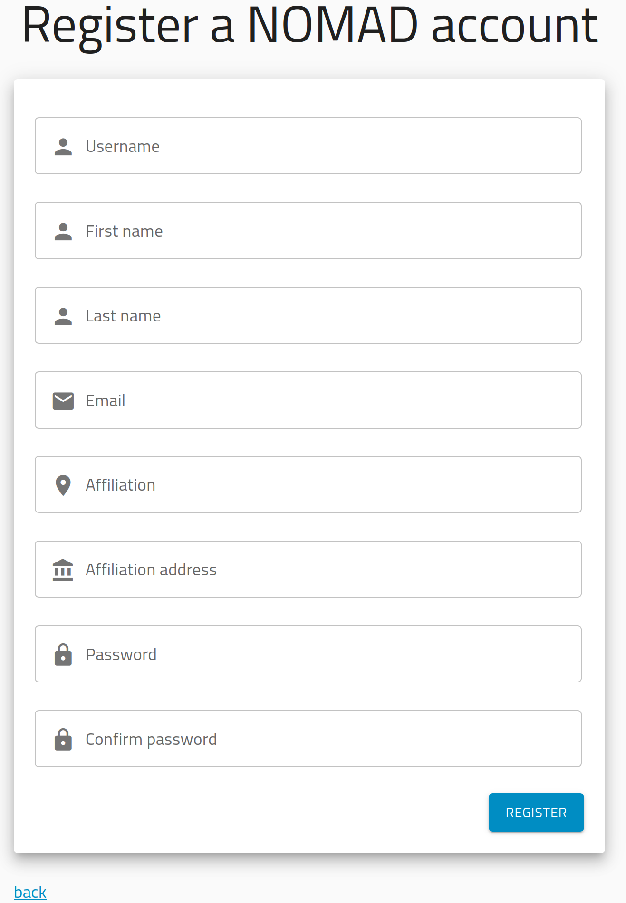

One of the main pillars of NOMAD is to enable scientists and researchers to **manage, share, and publish data** in an easy and efficient way. In this section, we will show you how you can use the central NOMAD Archive (or, equivalently, your local installations or OASIS) for this purpose. Alternatively, you can check the [Tutorial](https://nomad-lab.eu/prod/v1/staging/docs/tutorial.html) and [How-to upload/publish data](https://nomad-lab.eu/prod/v1/staging/docs/data/upload.html) in the general NOMAD documentation.

## Creating a NOMAD account

Before being able to upload and publish data in NOMAD, you need to create your personal account.

Go to the [NOMAD website](https://nomad-lab.eu/nomad-lab/) and click on the button `Open NOMAD`. This will take you to the [NOMAD GUI](../glossary/glossary.md/#gui). The purpose of this site is to allow users to search, access, and download data using an intuitive and appealing interface.

On the top right, click on `LOGIN / REGISTER`. 

You can then create an account by clicking on `New user? Register`.

    

After filling the blanks and clicking on `REGISTER`, you will receive a verification email. Once you verify your personal account, you can start using NOMAD.

!!! note
    In practice, you can create as many accounts as you want. However, we recommend you to create a single one
    for managing your data in the platform. Otherwise, this can interfere with other functionalities, e.g.,
    when a collaborator wants to add you as a member of an upload but instead finds a list of possible accounts.